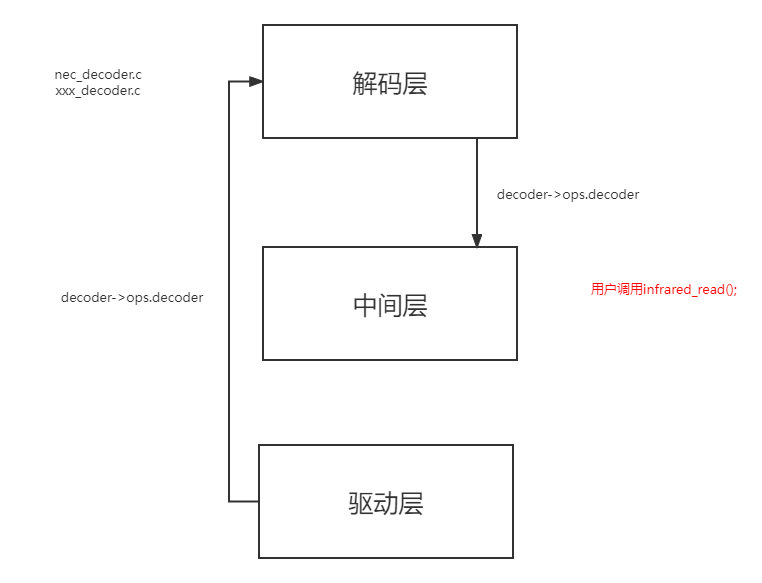

# 红外框架

## 简介

红外框架，基于 `rt-thread` 的 `pin` , `hwtimer` 驱动实现的复数通道红外接收解码框架。
发送可参考另外一个infrared软件包

## 驱动框架

 

### 目录结构

multi_infrared 软件包目录结构如下所示：

```c 
multi infrared
├───docs                            // 文档
├───inc                             // 头文件
├───src                             // 源文件				
│───LICENSE                         // 软件包许可证
│───README.md                       // 软件包使用说明
└───SConscript                      // RT-Thread 默认的构建脚本
```

###  许可证

multi_infrared 软件包遵循 Apache-2.0 许可，详见 LICENSE 文件。

### 获取软件包

使用 multi_infrared 软件包需要在 RT-Thread 的包管理中选中它，具体路径如下：

```c
RT-Thread online packages
    peripheral libraries and drivers  --->
         [*] multi_infrared : multi_infrared is base on rt-thread pin,hwtimer.  --->   
			   Select multi infrared decoder  --->                                 
		 [*]   Use the multi infrared driver provided by the software package
		 [*]     Enable multi infrared receive                               
		 (timer5)  multi infrared receive hwtimer dev name            
		 (4)       multi infrared receive channel nums                  
			   Version (latest)  --->
```

decoder 解码器选择nec
```c
[*] enable nec decoder
```

### 使用示例

```c
/* 选择解码器 */
static struct infrared_class *infrared[MULTI_INFRARED_RECEIVE_CHANNEL_NUM];
struct infrared_decoder_data infrared_data[MULTI_INFRARED_RECEIVE_CHANNEL_NUM];

/* infrared init*/
for(uint8_t i = 0;i < MULTI_INFRARED_RECEIVE_CHANNEL_NUM;i++)
{
	infrared[i] = infrared_find(i);
}

while (1)
{
	/* 读取数据 */
   for(uint8_t i = 0;i < MULTI_INFRARED_RECEIVE_CHANNEL_NUM;i++)
   {
		if(infrared_read(infrared[i],&infrared_data[i]) == RT_EOK)
		{
			if(infrared_data[i].data.nec.repeat)
			{
				if(is_print&0x04)
					rt_kprintf("channel %d repeat %02X %02X %02X %02X %d\n",i,infrared_data[i].data.nec.custom1,infrared_data[i].data.nec.custom2,infrared_data[i].data.nec.key1,infrared_data[i].data.nec.key2,infrared_data[i].data.nec.repeat);                                                                                                                 
			}
			else
			{
				if(is_print&0x04)
					rt_kprintf("channel %d %02X %02X %02X %02X\n",i,infrared_data[i].data.nec.custom1,infrared_data[i].data.nec.custom2, infrared_data[i].data.nec.key1,infrared_data[i].data.nec.key2);               }
	     }
    }	  
	rt_thread_mdelay(10);
}
```

### 关于如何增加/删除通道
1）首先在drv_infrared.c中找到

```c
/*if need add channel please add pin num , actual num must equal to MULTI_INFRARED_RECEIVE_CHANNEL_NUM*/
const static rt_base_t receive_pin[MULTI_INFRARED_RECEIVE_CHANNEL_NUM] = {GET_PIN(D,4),GET_PIN(D,3),GET_PIN(E,7),GET_PIN(E,5)};
/*----------------------------------------------------*/
void  (*pin_hdr[MULTI_INFRARED_RECEIVE_CHANNEL_NUM])(void *) = {receive_pin1_callback,receive_pin2_callback,receive_pin3_callback,receive_pin4_callback};
```
这两个数组中分别添加红外接收的引脚编号和对应的中断服务函数名称，其中中断服务函数内容参考已有通道添加，请注意数组内的引脚和函数名要一一对应，并且一定要与MULTI_INFRARED_RECEIVE_CHANNEL_NUM（menuconfig中定义）相等
中断服务函数具体内容请参考已有通道添加，注意其中的数组索引要与实际引脚对应

2）在infrared.c中找到以下函数
```c
/* if add channel add infrared pointer here!!! note channel num must be equal to MULTI_INFRARED_RECEIVE_CHANNEL_NUM*/
struct infrared_class *infrared_find(rt_uint8_t idx)
{
   ...
}
```
参考已有通道，在其中添加对应infrared_class类实例指针的返回

3）main.c中
参考使用实例，利用定义好的struct infrared_decoder_data infrared_data[MULTI_INFRARED_RECEIVE_CHANNEL_NUM]对每一个通道数据进行读取
### 关于如何增加不同解析的协议
nec_decoder.c中nec_decoder_decode函数参数代表驱动输入检测到的下降沿电平时间间隔（100us个数），可以根据实际协议内容，修改该函数的解析逻辑，解析不同数据传入环形buffer中，由应用层读取。可参考nec解码自行实现别的协议解析

### 联系方式 & 感谢

- 维护：jsrdczy
- 主页：https://github.com/jsrdczy/rt_thread_multi_infrared_frame.git
